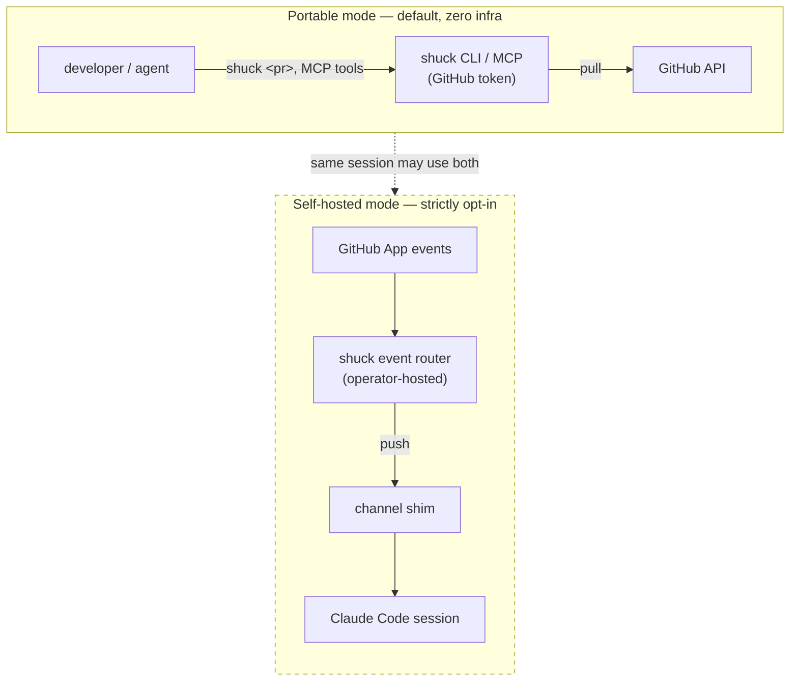
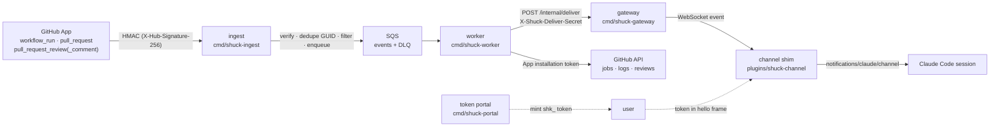
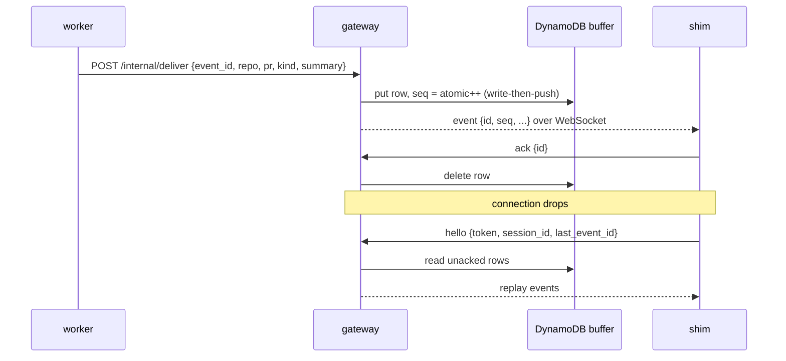
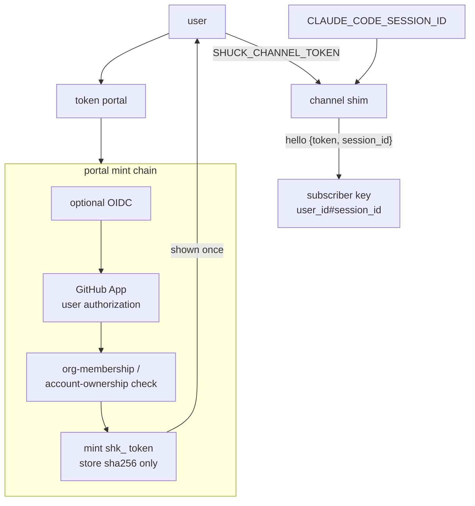
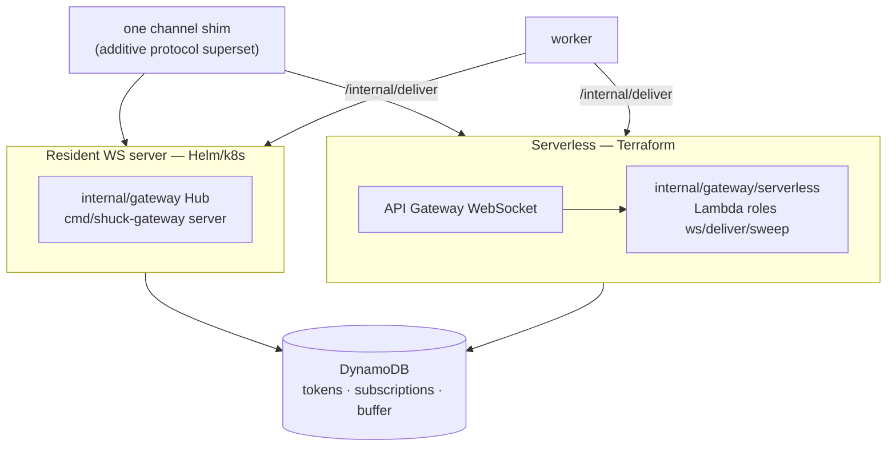
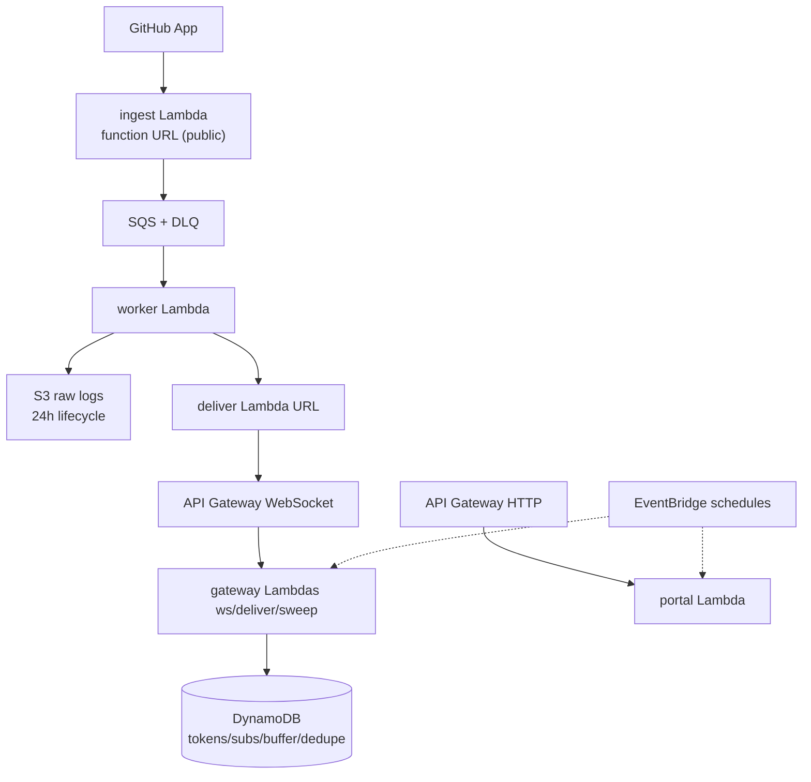
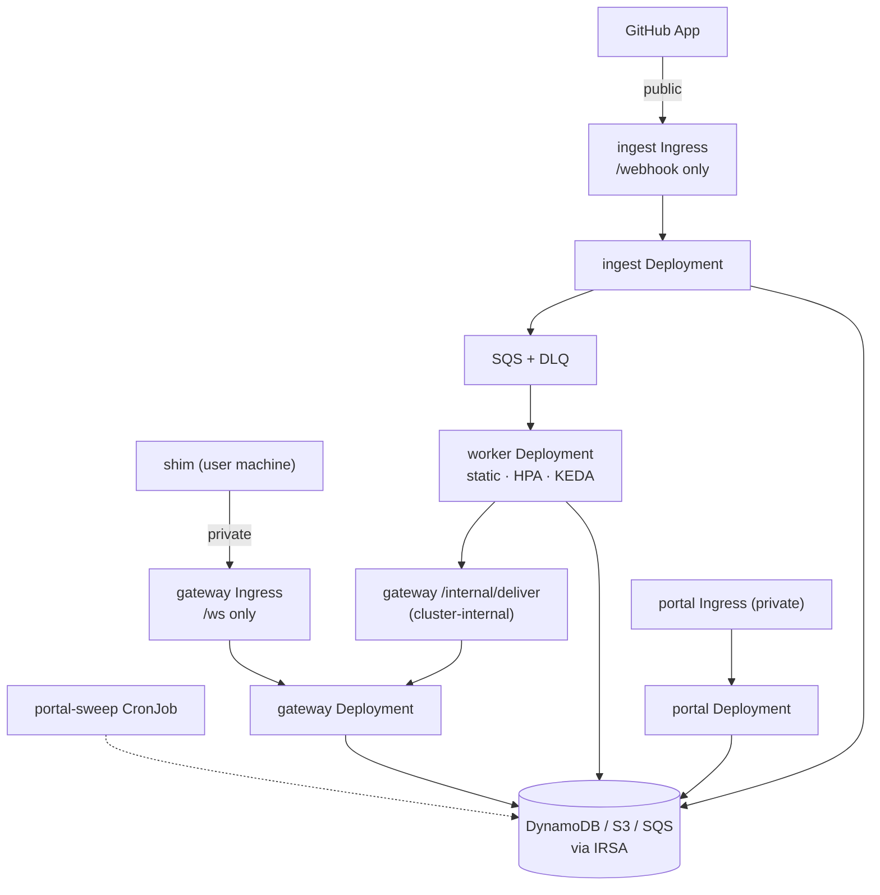

# shuck architecture

How shuck is built, end to end — the two modes, the self-hosted event
router's pipeline, its identity and delivery model, the two gateway shapes,
and the two deployment topologies.

This is the current **as-built** reference. For the per-ticket implementation
history and deviations see [`docs/V2.md`](V2.md) (a running dev log, not an
architecture doc); for the security analysis see
[`docs/THREAT-MODEL.md`](THREAT-MODEL.md); for operating a deployment see
[`docs/RUNBOOK.md`](RUNBOOK.md).

## Two modes

<a id="two-modes"></a>shuck has two modes. They work independently, can be
used together, and the second never breaks the first.

1. **Portable mode (the default).** The `shuck` CLI / MCP server with a GitHub
   token. Pull-based, zero infrastructure. Every subcommand, MCP tool, flag,
   cache behaviour, exit-code contract, the versioned `--json` schema, and the
   Claude Code plugin work with nothing deployed and no channel configured.
   **This is the default way to use shuck and the rest of this repo's docs
   apply to it as-is.**
2. **Self-hosted mode (strictly opt-in).** The v2 event router: GitHub App →
   webhook ingest → SQS → worker → gateway → channel shim → Claude Code
   session. Push-based. It is active **only** when an operator deploys the
   backend **and** a user installs the channel shim with a minted token. No
   shuck component auto-enables it.

The two compose: a channel-subscribed session can still use the pull-based MCP
tools, and channels-blocked environments keep the pull path as the fallback.



**Compatibility guarantee.** v2 work changes portable behaviour only
additively, never as a side effect. CI enforces the portable binary's import
graph: the root `shuck` binary never links `internal/ingest`,
`internal/gateway`, `internal/worker`, or `internal/portal`, so the AWS SDK and
WebSocket stack are never in its dependency closure. Backend components are
separate binaries under `cmd/`. Shared packages (`internal/distil`,
`internal/logs`, `internal/model`) are consumed by both modes; changes there
keep the CLI/MCP golden outputs byte-identical.

## System overview

The router closes the CI-feedback loop **off-agent**. Instead of an agent
burning tokens and latency polling `gh` to discover a run failed, a GitHub App
receives the event, a worker fetches and distils it (CI failures go through the
shared `internal/distil.CIFailure` core — the same code path the CLI uses; the
`review` / `review_comment` formatters in the same package are worker-only, the
CLI's reviews view being a separate GraphQL path), and a gateway pushes
the distilled context into the subscribed session within seconds.



The worker never reads workflow YAML — step commands are recovered from the
logs by `internal/distil` (a v1 design rule shared with the CLI). Raw logs may
be archived to S3 with a pointer in the summary; that archive is best-effort
and never fails an envelope.

## Event kinds and delivery semantics

Four envelope kinds flow through the queue:

| Kind | Trigger | Payload the worker distils |
| --- | --- | --- |
| `ci_failure` | `workflow_run` completed with conclusion `failure` / `cancelled` / `timed_out` | failed/cancelled jobs → per-step failure detail + agent-ready summary |
| `pr_closed` | `pull_request` closed/merged | none — clears the PR's subscriptions |
| `review_comment` | `pull_request_review_comment` | comment + thread + hunk + ±`SHUCK_REVIEW_CONTEXT_LINES` file lines at head |
| `review` | `pull_request_review` submitted | verdict + body + all inline comments (one event per human review action) |

Delivery is **write-then-push, at-least-once, ordered per subscriber**:

- The gateway writes the buffer row **first** (DynamoDB), then pushes over the
  live socket. The socket push is a latency optimisation; the buffer is the
  source of truth.
- `seq` is a DynamoDB atomic counter per subscriber (monotonic, gaps harmless).
- The shim **acks** each event by id; an ack deletes the buffer row.
- On reconnect the shim replays unacked events (resident: from
  `last_event_id`; serverless: the full unacked buffer — re-sends are free, the
  shim dedupes by event id). Ordering is strict per subscriber on the resident
  path (one writer goroutine); on the serverless path concurrent deliver
  invocations each drain the unacked buffer, so a shim's *first sight* of two
  near-simultaneous events can be out of seq order — replay always re-presents
  them in order, and the shim's event-id dedupe absorbs the re-sends.
- `event_id` is **always the webhook delivery GUID**, so SQS redeliveries and
  deliver retries dedupe in the gateway.
- Fan-out is per `repo#pr` across every subscriber.
- A **grace window** (default 24h) elapses before a disconnected session's
  subscriptions and buffer are swept.



Self-authored suppression is **kind-scoped** — it applies to `review` /
`review_comment` (you never notify your own sessions about your own comment),
never to `ci_failure`. The worker's `SHUCK_IGNORE_AUTHORS` bot guard is the
global complement (drop events authored by the App's own bot identity or an
agent-comment loop).

## Identity model

- **User identity = the Shuck token.** `shk_` + 32 random bytes, minted via the
  portal after GitHub identity verification. The server stores only
  `sha256(token) → {github_user_id (immutable numeric), github_login,
  repo_allowlist (reserved, empty in v1), created}` plus an additive
  `last_used` the gateway stamps best-effort. Regenerate = atomic revoke + mint.
- **Session identity = `CLAUDE_CODE_SESSION_ID`**, present in the stdio MCP
  environment (verified on Claude Code 2.1.201; it equals the session UUID that
  `--resume` preserves). Fallback: an ephemeral UUID + a stderr warning.
- **Subscriber key = `user_id#session_id`, everywhere.** Session IDs are
  client-supplied and untrusted; namespacing every key by the token's
  `user_id` means presenting someone else's session ID yields nothing.



## Auth and authorisation edges

| Edge | Mechanism |
| --- | --- |
| GitHub → ingest | Webhook secret HMAC (`X-Hub-Signature-256`), constant-time; delivery-GUID dedupe. The **only unauthenticated** public component (plus its `/healthz`, which touches nothing). |
| Worker → GitHub | App private key → short-lived cached installation tokens (RS256 App JWT). Permissions: `actions:read`, `pull_requests:read`, `members:read`, plus `contents:read` for the ±N file-context lines on review comments (absent, that context degrades to hunk-only). No PATs. |
| User → portal | Optional generic OIDC (any issuer, or none) → GitHub App user authorization → org-membership / account-ownership check → token mint. |
| Continuous re-validation | Daily sweep re-checks each token holder's current org membership and revokes departed members. A validation **error is always "unknown" — never a refusal, never a revoke**. |
| Shim → gateway | Per-user bearer token in the `hello` frame, over TLS. |
| Worker → gateway deliver | `X-Shuck-Deliver-Secret` shared-secret header, constant-time, two accepted values for rotation. App-layer auth, never topology alone. |

Secrets are **env-injected everywhere** (the GitHub App private key also has a
`SHUCK_GITHUB_APP_PRIVATE_KEY_FILE` variant, which is how the Helm chart mounts
it; the other secrets are env-value-only). No component reads Secrets Manager;
the Terraform target generates its secrets in-stack and injects them as env.

## The two gateway shapes

The gateway exists in two shapes that share **one set of DynamoDB stores
(frozen schemas), one wire protocol, and one worker deliver contract**. Workers
and shims are agnostic to which they're talking to.



1. **Resident WebSocket server** (`internal/gateway` Hub, `cmd/shuck-gateway`
   server mode) — a long-lived process that terminates shim WebSockets itself:
   30s protocol heartbeats, real close codes, an in-process grace-window
   sweeper, `/healthz` + `/readyz`, SIGTERM drain. **This is the Helm/k8s
   shape.**
2. **Serverless API Gateway WebSocket variant** (`internal/gateway/serverless`,
   Lambda roles `ws` / `deliver` / `sweep` of the same binary) — API Gateway
   terminates the sockets; per-invocation handlers run the same auth,
   newest-wins, write-then-push, and replay semantics over the same tables,
   with a durable connection registry (extra sort keys in the buffer table that
   the resident shape simply never writes). **This is the Terraform shape.**

One shim serves both via a small **additive protocol superset**, inert against
the resident gateway:

- the 4401/4409 verdicts also exist as in-band `{"type":"unauthorized"}` /
  `{"type":"replaced"}` control frames (API Gateway cannot send application
  close codes);
- the shim sends an app-level `{"type":"ping"}` every 5 minutes (defeats API
  Gateway's 10-minute idle timeout and doubles as the durable presence touch;
  the resident hub ignores it).

Expect routine reconnects at API Gateway's 2-hour connection cap — backoff plus
buffered replay absorb them.

## Wire protocol (shim ↔ gateway)

```
→ hello       {token, session_id, last_event_id?}
→ subscribe   {repo, pr}
→ unsubscribe {repo, pr}
→ ack         {id}
→ ping        {}                      # superset: serverless keepalive/presence
← event       {id, seq, repo, pr, kind, summary}
← {"type":"unauthorized"|"replaced"}  # superset: in-band close verdicts
```

Close codes (resident server): `4401` unauthorized, `4409` replaced (newest
connection wins), `1001` drain. A connection delivers nothing until a `hello`
authenticates; the resident server closes a socket that hasn't sent its
`hello` within the handshake timeout (10s default), while the serverless
shape leaves it to API Gateway's idle timeout.

## Deployment topologies

Two official targets share the same four backend binaries
(`cmd/shuck-{ingest,worker,gateway,portal}`) + SQS + DynamoDB + S3. **Deploy /
upgrade order is a contract: `shuck-worker` before `shuck-ingest`** (an old
worker treats new envelope kinds as poison → DLQ).

### Serverless (Terraform) — [`deploy/terraform`](../deploy/terraform/README.md)



The cheap solo path: Lambda everything, API Gateway WebSocket + HTTP APIs,
EventBridge sweeps, per-function IAM, secrets generated in-stack. **Idle cost
≈ $0 — no fixed-cost component**; first real charges are API Gateway WS
messages / connection-minutes and CloudWatch Logs.

### Kubernetes (Helm) — [`deploy/helm/shuck`](../deploy/helm/shuck/README.md)



The org / dogfood path: the resident binaries in-cluster, a **public/private
ingress split** (public `/webhook` on its own class for WAF/rate-limits;
private `/ws` + portal on an internal LB), IRSA for DDB/S3/SQS, opt-in HPA/KEDA
scaling, opt-in NetworkPolicy, a `wait-for-worker` initContainer enforcing the
deploy order. The `/internal/deliver` endpoint is never routed by any ingress.

**Public-webhook constraint.** GitHub must reach the webhook endpoint from the
internet. In the EKS deployment, setting `ingest.mode: lambda` deploys no
in-cluster ingest at all — the Terraform module's tiny public ingest Lambda
drops into the same SQS queue and the cluster keeps **zero public surface**.

**Dead end, recorded so nobody revisits it.** App Runner was the original
serverless gateway host; it has no WebSocket support
([apprunner-roadmap#13](https://github.com/aws/apprunner-roadmap/issues/13),
closed not-planned) and was replaced by the API Gateway WebSocket design above.
Fargate + ALB was rejected for its fixed idle cost.

## Stores and retention defaults

The DynamoDB table schemas are frozen and documented in
[`docs/V2.md` § JUS-88](V2.md); they are not restated here. The retention and
timeout defaults below are authoritative — other docs reference this table
rather than restating the numbers.

| Datum | Default | Where |
| --- | --- | --- |
| Raw job logs | 24h | S3 lifecycle (provisioned with the bucket, never in worker code) |
| Buffered events | 72h | DynamoDB TTL on the buffer table |
| Disconnected-subscriber grace | 24h | gateway sweep before dropping subscriptions/buffer. Subscription and presence rows carry **no TTL** — the sweep is their only cleanup, so it must stay healthy (see the runbook) |
| Webhook delivery-GUID dedupe | 1h | DynamoDB TTL on the dedupe table |
| Summary cap | 16 KiB | `distil.CapSummary` (S3 pointer when a raw log is archived) |
| Gateway heartbeat (resident) | 30s | `SHUCK_HEARTBEAT` — the LB-idle-timeout defense |
| Shim keepalive ping (serverless) | 5 min | protocol superset; defeats API GW's 10-min idle timeout |
| App installation token | short-lived, cached | minted per run by the worker |

Buffer TTL (72h) and the grace window (24h) are shipped defaults to revisit
after dogfooding.

## See also

- [`docs/THREAT-MODEL.md`](THREAT-MODEL.md) — trust boundaries, what is and
  isn't defended.
- [`docs/RUNBOOK.md`](RUNBOOK.md) — operating a deployment.
- [`docs/V2.md`](V2.md) — the per-ticket implementation log and the frozen
  table schemas.
- [`deploy/terraform/README.md`](../deploy/terraform/README.md) /
  [`deploy/helm/shuck/README.md`](../deploy/helm/shuck/README.md) — the two
  deploy walkthroughs.
