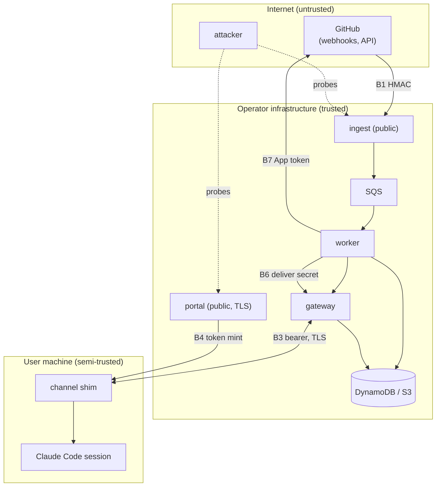

# shuck threat model

A practical, STRIDE-informed threat model for shuck's **self-hosted event
router** (the opt-in v2 backend). It is written so a security engineer can read
it once and know exactly what is defended, how, and what is deliberately left
as residual risk.

> **Portable mode is the default and is out of scope here.** The `shuck` CLI /
> MCP server with a GitHub token is pull-based and deploys nothing; its only
> "credential surface" is a GitHub token the user already holds. Everything
> below concerns the strictly opt-in backend. See
> [`docs/ARCHITECTURE.md#two-modes`](ARCHITECTURE.md#two-modes) for the
> two-mode contract.

Positioning: **single operator, multi-user** — one GitHub org or personal
account, one App installation, one backend, all data in the operator's
infrastructure. Not multi-tenant SaaS. The v1 access-control plane is **GitHub
org membership**, and the trust boundary between the operator and their own
users is deliberately thin.

## Assets

- **Shuck tokens** (`shk_…`) — bearer credentials for event subscriptions.
  Stored only as SHA-256 hashes.
- **The GitHub App private key** — mints installation tokens that can read
  Actions, PRs, and org membership. The highest-value secret.
- **The deliver / webhook / session secrets** — shared secrets protecting the
  deliver endpoint, webhook authenticity, and portal sessions.
- **Distilled event summaries** — CI/review context in transit to sessions.
  Low confidentiality (the subscriber can already read the PR) but they enter
  an agent's context, which is its own concern (§ Channel → session).

## Trust boundaries

The numbered boundaries below are analysed as threat → mitigation → residual.

## Public surface inventory

The backend exposes exactly **two** public endpoints, and only one is
unauthenticated at L7:

1. **The ingest endpoint** (`/webhook`, a Lambda function URL or an in-cluster
   Ingress) — a single stateless component that verifies GitHub's HMAC before
   parsing the body. Nothing else is reachable from it.
2. **The portal** — behind TLS, with an optional OIDC gate in front of the
   GitHub-identity flow; HMAC-signed session cookies.

The **gateway WebSocket** accepts connections but delivers nothing until a
`hello` frame authenticates; unauthenticated sockets die at the idle timeout.
The **deliver endpoint** (`/internal/deliver`) is never routed by any public
ingress and additionally requires the shared secret. Everything else (queue,
tables, bucket, worker) has no public surface at all.

## Boundary analysis

### B1 · GitHub → ingest (spoofing, replay, tampering)

- **Threat.** An attacker forges webhook deliveries to inject fake events, or
  replays a captured delivery, or tampers with a legitimate payload in flight.
- **Mitigation.** Every request is HMAC-verified against `X-Hub-Signature-256`
  with the webhook secret, **constant-time, before the body is parsed** — a
  bad or missing signature is a fail-closed 401 and the payload is never
  interpreted. Replays are caught by `X-GitHub-Delivery` GUID dedupe (DynamoDB,
  1h TTL). The delivery GUID also becomes the downstream `event_id`, so a
  replay that somehow passed would still dedupe at the gateway.
- **Residual.** An attacker who steals the webhook secret can forge events
  (mitigated only by rotating the secret). Volumetric floods against the public
  endpoint are handled outside shuck (WAF/rate-limit on the dedicated public
  route — the k8s target isolates `/webhook` on its own ingress class for
  exactly this).

### B2 · Untrusted log / review content → parser

- **Threat.** PR authors influence CI log content and review text. That
  attacker-controlled text is parsed by shuck's distillation core and, before
  that, by the ingest event filter and the portal cookie codec. A parser bug is
  a memory-safety / DoS / mis-parse risk.
- **Mitigation.** **Every parser of untrusted input is fuzzed**, and every
  minimized crasher is committed as a regression seed before the bug is fixed —
  `internal/logs`, `internal/distil`, `internal/semver`, `internal/action`,
  `internal/image`, `internal/target`, `internal/compliance`,
  `internal/release`, the ingest event filter, and the portal session cookie
  codec. Fuzz targets assert semantic invariants (round-trips, selection
  contracts, fail-closed verification), not just panic-safety. Concrete finds
  now guarded by seeds: `FuzzIngestFilter` dropped `workflow_run` payloads with
  a zero run id or empty `pull_requests[].number`; the portal cookie codec's
  non-canonical-base64 malleability (§ B8). Summaries are byte-budgeted by
  `distil.CapSummary` (16 KiB default) so a hostile log cannot balloon a
  delivery.
- **Residual.** Fuzzing narrows but never eliminates parser risk; Go's
  memory-safety bounds the blast radius to logic errors and DoS, not RCE.

### B3 · User ↔ user isolation

- **Threat.** A user (or a hostile client) presents someone else's
  `session_id` to read another session's events, or spoofs identity to
  subscribe on another user's behalf.
- **Mitigation.** The subscriber key is **`user_id#session_id` everywhere**,
  where `user_id` comes from the authenticated token, not the client. Session
  IDs are treated as untrusted and client-supplied; presenting another user's
  session ID lands in that other user's namespace only if you also hold their
  token, so it yields nothing. A duplicate connection for the same subscriber
  is resolved **newest-wins** (`4409 replaced` / in-band `{"type":"replaced"}`).
  This isolation has a direct test (session-ID spoof yields no cross-user
  data).
- **Residual.** Within a single user, all of that user's sessions are equally
  trusted (by design — they are the same person). Token theft collapses the
  boundary (§ B4).

### B4 · Token lifecycle

- **Threat.** Token theft, over-long token lifetime, tokens outliving the
  holder's access (offboarding), or a mint flow that hands tokens to the wrong
  person.
- **Mitigation.** Tokens mint **only** after GitHub App user-authorization plus
  org-membership (or account-ownership) validation. `shk_` prefix; **only the
  SHA-256 is stored**; the plaintext is **shown exactly once**. Regenerate is an
  atomic revoke-old + mint-new. A **daily sweep** re-validates every token
  holder against current org membership and revokes departed members — GitHub
  org membership is the access-control plane, offboarding included. Crucially, a
  validation **error is always treated as "unknown" — never a refusal and never
  a revoke** — so a GitHub API blip cannot mass-revoke live tokens.
- **Residual.** A stolen token is usable until it is regenerated or its holder
  loses org membership (bounded by the daily sweep). Tokens are bearer
  credentials; there is no per-request proof-of-possession.

### B5 · Org-wide subscribe scope

- **Threat.** A token can subscribe to event summaries for **any** PR in
  **any** repo the App is installed on — broader than a single user's
  repo-level GitHub permissions.
- **Mitigation / rationale.** This is a documented v1 trade-off: org membership
  is the access gate, and event summaries are low-confidentiality relative to
  the source PR (a subscriber generally could open the PR anyway). The token
  grants **no** GitHub access — workers mint their own short-lived App
  installation tokens server-side; the token only authorizes subscriptions.
- **Residual / fast-follow.** Per-user **repo-level** permission mirroring is
  not in v1. The `repo_allowlist` field is reserved in the token schema and
  written empty, so a future release can narrow scope per token without a
  schema migration. Until then, treat "member of the org" as "may see summaries
  for any installed repo."

### B6 · Worker → gateway deliver

- **Threat.** An attacker who reaches the deliver endpoint injects fabricated
  summaries into arbitrary subscribers' sessions.
- **Mitigation.** `/internal/deliver` is never publicly routed and requires the
  `X-Shuck-Deliver-Secret` shared secret, compared **constant-time**, with two
  accepted values so the secret can rotate without downtime. This is app-layer
  auth — the network topology (private ingress, NetworkPolicy) is defence in
  depth, never the only layer.
- **Residual.** A leaked deliver secret allows summary injection until rotated;
  the injected text is still bounded by `CapSummary` and enters only sessions
  the attacker can name a valid `user_id#session_id` for.

### B7 · Worker → GitHub

- **Threat.** Over-privileged or long-lived GitHub credentials on the worker.
- **Mitigation.** The worker holds only the App private key and mints
  **short-lived, cached installation tokens** (RS256 App JWT) scoped to
  `actions:read`, `pull_requests:read`, `members:read`. **No PATs.** The private
  key is env-injected (or file-mounted via `SHUCK_GITHUB_APP_PRIVATE_KEY_FILE`),
  never in Secrets Manager.
- **Residual.** The App private key is the crown jewel; its compromise is the
  worst case (read access to Actions/PRs/membership across the installation).
  Protect it accordingly (§ Secrets).

### B8 · Portal session-cookie integrity

- **Threat.** Forged or malleable session cookies granting portal access, or a
  padding/decoding oracle.
- **Mitigation.** Stateless HMAC-signed session cookie, `Secure` + `HttpOnly` +
  `SameSite=Lax`. The codec decodes **strict base64, fail-closed**, and returns
  a single `ErrBadSession` (no distinguishing oracle). This closed a
  fuzz-discovered malleability: non-canonical base64 encodings previously
  decoded to the same bytes, letting a cookie be mutated without breaking the
  HMAC — the strict decoder now rejects them, and the crasher is a regression
  seed. GitHub Apps do not support PKCE, so the CSRF defense on the GitHub leg
  is the session-bound `state` parameter; mint is CSRF-protected.
- **Residual.** Cookie theft via a compromised user machine or a portal XSS
  (mitigated by TLS + the cookie flags + templated HTML) would grant portal
  access to mint tokens for that already-authenticated identity.

### B9 · Channel content → Claude session (prompt injection)

- **Threat.** This is the boundary most worth stating plainly. Distilled CI and
  review summaries are **still attacker-influenceable text** — a PR author
  controls CI log lines and review comment bodies — and that text is delivered
  **into an agent's context**. It is a prompt-injection surface.
- **Mitigation (partial, by design).** Distillation **narrows** the surface: the
  worker extracts and byte-caps a high-signal excerpt rather than forwarding raw
  logs, so the volume and freedom of attacker-controlled text reaching the
  session is reduced, and self-authored / bot events are suppressed
  (`SHUCK_IGNORE_AUTHORS` and kind-scoped self-suppression) so an obvious inject
  loop is cut. The summary is a **notification**, not an instruction channel —
  the shim delivers it as `notifications/claude/channel` content, and the
  session's own instructions and the human in the loop remain the arbiter of
  what to act on.
- **Residual (explicitly not fully defended).** Distillation does **not remove**
  the surface. A determined author can put adversarial text in a CI log or a
  review comment and it can reach a subscribed agent's context. Operators and
  users should treat delivered summaries as **untrusted external data**, exactly
  as they would treat the PR itself — the same guidance shuck follows for any
  externally-authored content. shuck does not claim to sanitize semantic
  prompt-injection out of attacker-controlled prose.

## Secrets handling

- **Env-injected everywhere.** No component reads Secrets Manager. `SHUCK_*`
  env vars, with `SHUCK_*_FILE` variants for Kubernetes secret mounts (the App
  private key is always a file mount, never an env value).
- **Terraform** generates the deliver/webhook/session secrets in-stack; they
  never leave it. **Treat the Terraform state as secret material.**
- **Helm** sources one k8s Secret from chart values (dev only — values end up
  in state/history), an `existingSecret`, or an ExternalSecret via ESO.

## Data minimization and retention

The SQS **envelope is slim** — it carries identifiers and event coordinates,
never the raw webhook payload; the worker fetches detail server-side with its
own token. (The one documented exception: review envelopes carry
`author_id`/`author_login` so self-suppression can run.) Everything expires on a
timer — see the authoritative table in
[`docs/ARCHITECTURE.md`](ARCHITECTURE.md#stores-and-retention-defaults): raw
logs 24h, buffered events 72h, disconnected-subscriber grace 24h, webhook
dedupe 1h.

## Trust model at a glance

The short version other docs link to:

- **Tokens** mint only after GitHub identity + org-membership validation; only
  their SHA-256 is stored; a daily sweep revokes departed members.
- **Scope**: a token grants event-summary subscriptions for repos the App is
  installed on — **no GitHub access**; workers mint their own server-side.
- **Ingress**: the webhook verifies GitHub's HMAC before parsing; the deliver
  endpoint requires the shared secret; the WebSocket delivers nothing until a
  `hello` authenticates; the portal is TLS with HMAC-signed cookies.
- **Retention**: raw logs 24h, buffered events 72h, disconnected subscribers
  swept after 24h, dedupe rows 1h; secrets env-injected, no Secrets Manager.

## Residual risks / explicitly NOT defended

- **Prompt injection** into a subscribed session is narrowed, not removed
  (§ B9) — the headline residual.
- **Single-operator trust**: users trust the operator's backend with their
  subscriptions; this is not a mutually-distrusting multi-tenant system.
- **No repo-level permission mirroring in v1** (§ B5); org membership is the
  gate, `repo_allowlist` is reserved.
- **Bearer tokens**: theft grants access until regeneration or offboarding.
- **App private key compromise** is the worst case (§ B7).
- **Gateway single replica** in the resident/k8s shape (in-memory connection
  registry); horizontal scaling with a DDB connection registry is deferred to
  JUS-95. Not a confidentiality risk — an availability/scale limit.

## STRIDE quick reference

| Boundary | S | T | R | I | D | E | Primary control |
| --- | :-: | :-: | :-: | :-: | :-: | :-: | --- |
| B1 GitHub → ingest | ✓ | ✓ | ✓ | | ✓ | | HMAC verify + GUID dedupe |
| B2 content → parser | | ✓ | | | ✓ | | fuzzing + regression seeds + CapSummary |
| B3 user ↔ user | ✓ | | | ✓ | | ✓ | `user_id#session_id`, newest-wins |
| B4 token lifecycle | ✓ | | | ✓ | | ✓ | verified mint, hash-at-rest, daily sweep |
| B5 subscribe scope | | | | ✓ | | ✓ | org-membership gate, `repo_allowlist` reserved |
| B6 deliver | ✓ | ✓ | | ✓ | | ✓ | shared secret, constant-time, private route |
| B7 worker → GitHub | | | | ✓ | | ✓ | least-privilege short-lived App tokens |
| B8 portal cookie | ✓ | ✓ | | | | ✓ | HMAC cookie, strict base64, `state` CSRF |
| B9 channel → session | ✓ | | | | | | distillation narrows (residual, § B9) |

## Reporting

Security vulnerabilities go through [`SECURITY.md`](../SECURITY.md), not public
issues.
